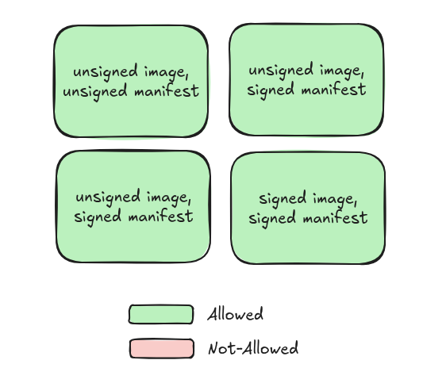

# 03 - Creating a manifest for our simple App

In this section, we will proceed with [creating a simple deployment](./01-create-manifest.sh) for our simple App. Because we will be showing how to control admission of both manifests and container images, there will be one version of the deployment for the signed image, and another one for the unsigned. Following on as we did with the simple App, we will [package it as an OCI artifact](./02-create-and-push-oci-artifact.sh) and create [a signed and an unsiged version](./03-sign-kube-manifest.sh). The end result will be 4 OCI artifacts containing the manifests. If you were to deploy them now to your cluster, you would observe that all 4 OCI artifacts can be deployed:



```sh
bash ./01-create-manifest.sh
bash ./02-create-and-push-oci-artifact.sh
bash ./03-sign-kube-manifest.sh
```
