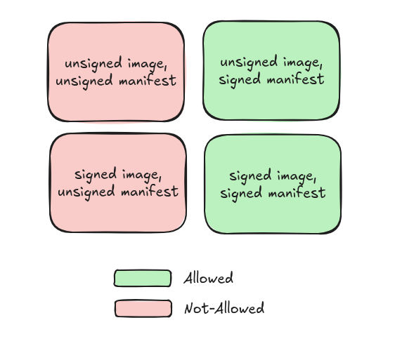

# 04 - Validating signature at deploy time

In this section we will demonstrate how to leverage Flux CD and Kyverno to verify the signature of the OCI artifacts we intend to deploy. Note that both examples achieve the same outcome, just through different mechanisms. After the manifests in this section have been applied, you will be able to deploy signed OCI artifacts, whilst unsigned OCI artifacts are rejected. However, we this section does not deal with validation of unsigned images deployed via signed OCI artifacts, so it would still be possible to deploy those:



> [!WARNING]
>
> Do not delete the Kyverno policies after finishing this section. We will use them as stepping stone for the following one.

## Flux CD

Flux CD provides a custom resource called OCIRepository. Its `.spec.verify` block allows to specify a key to verify the cryptographic signatures of the deploy artifact. In [our example](./flux-ocirepo.yaml), it references the key we created back in [the first section](../01-openbao-transit-engine/). This will automatically validate the signature of the OCI artifact. In the case of the unsigned OCI artifacts, these will be rejected by FluxCD.

```sh
bash ./01-deploy-and-flux-verify.sh
bash ./02-cleanup.sh
```

> [!TIP]
>
> The `.spec.verify` field in an `OCIRepository` resource is optional. This means that if you want to enforce signature validation of these kinds of resources, you will need an additional policy that ensures that this field when deploy it to the cluster.

## Kyverno

Kyverno can also verify the signature of the deployed OCI artifact. It does so via an `ImageValidatingPolicy` resource. The key parts of our example [policy](./kyverno-verify-oci-artifact-signature.yaml) are:

- `.spec.matchImageReferences` select which images are we looking for within `OCIRepository` resources.
- `.spec.attestors` configures the policy to leverage Cosign for attestion verification.
- `.spec.validations` specifies the validation clauses. In our case, we reject `OCIRepository` resources without artifacts (malformed), and verify that the provided OCI artifact is signed with the key we created.

```sh
bash ./03-kyverno-policies.sh         # Apply Kyverno policies first this time
bash ./01-deploy-and-flux-verify.sh
bash ./02-cleanup.sh
```

> [!TIP]
>
> Note that this time, the error that you receive for unsigned OCI artifacts comes from Kyverno, even though the resources we deployed are the same as we did previously. This is because Kyverno intercepts the resources during admission control, whereas FluxCD performs the verification once the cluster admission control has cleared the resources to be deployed.

## References

- [FluxCD Docs - Source controllers - OCI Repositories](https://fluxcd.io/flux/components/source/ocirepositories/#verification)
- [Kyverno Docs - Policy Types - ImageValidatingPolicy](https://kyverno.io/docs/policy-types/image-validating-policy/)
