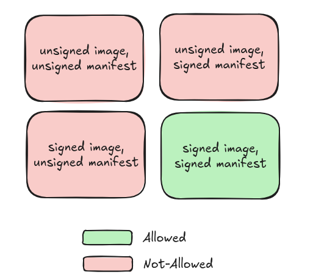

# 05 - Image signature verification

In the previous section, we validated the OCI artifact signature with both Flux CD and Kyverno. This step only validated the OCI artifact being deployed, which contained the manifest that will ultimately serve our simple App. However, it did not validate the image signature of the container image being used within the deployment. Currently, Flux CD does not have native capabilities to perform this verification, so we will rely on Kyverno again for this task.

The Kyverno policy this time is slight different:

- `.spec.matchConstraints` now targets `Pod` resources, as opposed to `OCIRepository` resources.
- `.spec.matchImageReferences` now targets the container image in the OCI registry, as opposed to the OCI artifact that contains the deployment manifest.
- `.spec.validations` leverages the `verifyImageSignatures`, which is a CEL function that is shipped with the `ImageValidatingPolicy` resource.

We will be re-using the same [deployment script](./02-deploy.sh) we used in the last section to verify the behaviour of the Kyverno policies. In this case (so long as you did not delete the Kyverno policies we deployed in the last section), we will see that only the signed OCI manifest artifact containing the signed container application is allowed to be deployed:



The commands to run this section are:

```sh
bash ./01-deploy-kyverno-policy.sh
bash ./02-deploy.sh
```

## References

- [Kyverno Docs - Policy Types - ImageValidatingPolicy](https://kyverno.io/docs/policy-types/image-validating-policy/)
- [Kyverno Docs - Policy Types - ImageValidatingPolicy - CEL libraries](http://kyverno.io/docs/policy-types/image-validating-policy/#cel-libraries)
